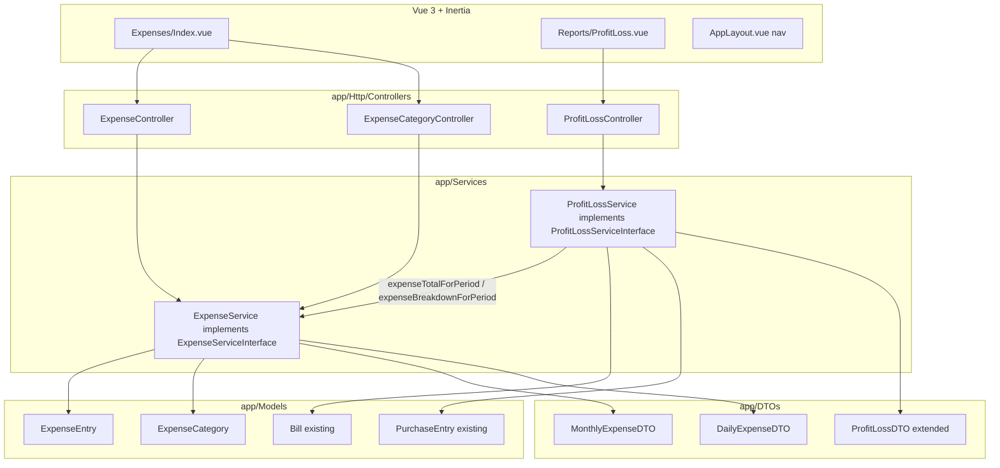
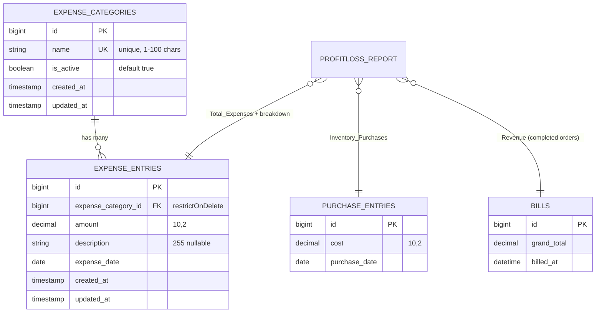

# Design Document

## Overview

This design adds an **Expense Tracking** capability to the WhiteJersey Cafe POS and integrates recorded expenses into the existing **Profit & Loss (P&L)** reporting. It introduces admin-managed custom expense categories, admin-recorded expense entries, and daily/monthly expense views grouped by category. It also splits the P&L "spending" figure into two separate line items — **Inventory Purchases** (existing) and **Expenses** (new) — and adds a per-category expense breakdown.

The feature is implemented entirely within the established application architecture: a **Service + Interface + DTO** pattern with container bindings in `DomainServiceProvider`, thin Inertia controllers, route-model-bound category management mirroring the existing `CategoryController`, and black/red-themed Vue 3 Inertia pages that mirror `Inventory/Index.vue` and `Reports/ProfitLoss.vue`.

Salary is treated as an ordinary expense category (seeded alongside Rent, Electricity, etc.). There is no separate staff-linked salary module; salary payments are recorded as expense entries under the *Salary* category, using the description to note the staff member's name.

### Design Principles (mirrored from existing code)

- **Validation lives in the service.** Each service method builds an `$errors` array and throws `Illuminate\Validation\ValidationException::withMessages($errors)`, exactly as `InventoryService::validatePurchaseData()` does. Controllers stay thin.
- **Money is `decimal` in the DB and `round($x, 2)` in PHP.** All monetary aggregates are rounded to two decimal places before leaving a service.
- **Dates are validated with Carbon**, rejecting future dates via `$date->startOfDay()->gt(Carbon::today())`.
- **DTOs are plain readonly classes** in `app/DTOs/` with constructor-promoted `public readonly` properties.
- **Admin-only enforcement** is done by placing routes inside the existing `auth` + `admin` middleware group; the `admin` alias resolves to `EnsureUserIsAdmin`.

## Architecture

### Layering



The `admin` middleware alias (`EnsureUserIsAdmin`) wraps every controller entry point via the route group, so authorization is uniform and never re-implemented per controller.

### Service Composition (P&L ↔ Expenses)

`ProfitLossService` gains a dependency on `ExpenseServiceInterface`, injected via the constructor. It keeps its own `calculateRevenue()` and renames the concept of "spending" into two sources:

- `calculateInventoryPurchases(start, end)` — the old `calculateSpending()` logic (sum of `purchase_entries.cost`).
- Expenses come from `ExpenseService::expenseTotalForPeriod()` and `ExpenseService::expenseBreakdownForPeriod()`, so the expense aggregation logic lives in exactly one place.

This composition (rather than duplicating queries) keeps the expense breakdown consistent between the standalone expense views and the P&L report.

### Entity Relationship Diagram



`PROFITLOSS_REPORT` is a computed view (the `ProfitLossDTO`), not a table — shown here to illustrate how the reporting reads from the three data sources.

## Components and Interfaces

### Migrations (SQLite)

Two migrations, named to follow the existing `2024_01_01_0000XX_*` sequence (next available indices `000009`, `000010`).

**`2024_01_01_000009_create_expense_categories_table.php`**

```php
Schema::create('expense_categories', function (Blueprint $table) {
    $table->id();
    $table->string('name', 100)->unique();
    $table->boolean('is_active')->default(true);
    $table->timestamps();
});
```

**`2024_01_01_000010_create_expense_entries_table.php`**

```php
Schema::create('expense_entries', function (Blueprint $table) {
    $table->id();
    $table->foreignId('expense_category_id')
        ->constrained('expense_categories')
        ->restrictOnDelete();          // preserve entries; forbid deleting a category with entries
    $table->decimal('amount', 10, 2);
    $table->string('description', 255)->nullable();
    $table->date('expense_date');
    $table->timestamps();

    $table->index('expense_date');     // daily/monthly range scans
    $table->index(['expense_category_id', 'expense_date']);
});
```

**FK delete decision — `restrictOnDelete`.** Requirement 1.10 requires expense entries to be *retained* after a category is deactivated. Deactivation is a soft state change (`is_active = false`), not a row delete, so entries are naturally retained. `restrictOnDelete` additionally guards against accidental hard deletion of a category that still owns entries — matching the domain intent that historical financial data is never silently discarded. (Menu categories use `cascadeOnDelete`, but expense entries are financial records where retention matters, so we intentionally differ here.)

### Models

**`app/Models/ExpenseCategory.php`**

```php
class ExpenseCategory extends Model
{
    use HasFactory;

    protected $fillable = ['name', 'is_active'];

    protected function casts(): array
    {
        return ['is_active' => 'boolean'];
    }

    public function expenseEntries(): HasMany
    {
        return $this->hasMany(ExpenseEntry::class);
    }
}
```

**`app/Models/ExpenseEntry.php`**

```php
class ExpenseEntry extends Model
{
    use HasFactory;

    protected $fillable = ['expense_category_id', 'amount', 'description', 'expense_date'];

    protected function casts(): array
    {
        return [
            'amount' => 'decimal:2',
            'expense_date' => 'date',
        ];
    }

    public function expenseCategory(): BelongsTo
    {
        return $this->belongsTo(ExpenseCategory::class);
    }
}
```

### Interface — `app/Contracts/ExpenseServiceInterface.php`

```php
interface ExpenseServiceInterface
{
    // Category management
    public function createCategory(array $data): ExpenseCategory;
    public function updateCategory(int $id, array $data): ExpenseCategory;
    public function deactivateCategory(int $id): void;
    public function activateCategory(int $id): void;
    public function listCategories(): Collection;    // all categories (active + inactive)
    public function activeCategories(): Collection;  // active only, for entry selection

    // Expense entries
    public function recordExpense(array $data): ExpenseEntry;

    // Views
    public function dailyExpenses(Carbon $date): DailyExpenseDTO;
    public function monthlyExpenses(int $year, int $month): MonthlyExpenseDTO;

    // Consumed by ProfitLossService
    public function expenseTotalForPeriod(Carbon $start, Carbon $end): float;
    public function expenseBreakdownForPeriod(Carbon $start, Carbon $end): array; // [{category_name, total}]
}
```

### Service — `app/Services/ExpenseService.php`

Follows `InventoryService` exactly: public methods delegate to private validators that build `$errors` and throw `ValidationException::withMessages($errors)`.

```php
class ExpenseService implements ExpenseServiceInterface
{
    public function createCategory(array $data): ExpenseCategory
    {
        $name = $this->validateCategoryName($data['name'] ?? null, ignoreId: null);
        return ExpenseCategory::create(['name' => $name, 'is_active' => true]);
    }

    public function updateCategory(int $id, array $data): ExpenseCategory
    {
        $category = ExpenseCategory::findOrFail($id);
        $name = $this->validateCategoryName($data['name'] ?? null, ignoreId: $category->id);
        $category->update(['name' => $name]);
        return $category;
    }

    public function deactivateCategory(int $id): void
    {
        ExpenseCategory::findOrFail($id)->update(['is_active' => false]);
    }

    public function activateCategory(int $id): void
    {
        ExpenseCategory::findOrFail($id)->update(['is_active' => true]);
    }

    public function listCategories(): Collection
    {
        return ExpenseCategory::orderBy('name')->get();
    }

    public function activeCategories(): Collection
    {
        return ExpenseCategory::where('is_active', true)->orderBy('name')->get();
    }

    public function recordExpense(array $data): ExpenseEntry
    {
        $data = $this->validateExpenseData($data);

        return ExpenseEntry::create([
            'expense_category_id' => $data['expense_category_id'],
            'amount'              => $data['amount'],
            'description'         => $data['description'],   // normalized '' when omitted
            'expense_date'        => $data['expense_date'],
        ]);
    }

    public function dailyExpenses(Carbon $date): DailyExpenseDTO { /* group by category, per-category entries + total, grand total */ }
    public function monthlyExpenses(int $year, int $month): MonthlyExpenseDTO { /* category totals + grand total */ }

    public function expenseTotalForPeriod(Carbon $start, Carbon $end): float
    {
        return round((float) ExpenseEntry::whereBetween('expense_date', [
            $start->toDateString(), $end->toDateString(),
        ])->sum('amount'), 2);
    }

    public function expenseBreakdownForPeriod(Carbon $start, Carbon $end): array
    {
        return ExpenseEntry::with('expenseCategory')
            ->whereBetween('expense_date', [$start->toDateString(), $end->toDateString()])
            ->get()
            ->groupBy(fn ($e) => $e->expenseCategory->name)
            ->map(fn ($group, $name) => [
                'category_name' => $name,
                'total'         => round($group->sum(fn ($e) => (float) $e->amount), 2),
            ])
            ->values()
            ->all();
    }

    // ── private validators (mirror InventoryService) ──
    private function validateCategoryName(?string $name, ?int $ignoreId): string { /* trim; required; max:100; unique */ }
    private function validateExpenseData(array $data): array { /* category active-exists; amount 0.01–9,999,999.99; desc ≤255; date valid & not future */ }
}
```

**`validateExpenseData` rules (from Requirement 2):**

| Field | Rule | Message trigger |
|---|---|---|
| `expense_category_id` | required | 2.3 |
| `expense_category_id` | must exist AND `is_active = true` | 2.4 |
| `amount` | `is_numeric` | 2.5 |
| `amount` | `>= 0.01` and `<= 9999999.99` | 2.6 |
| `amount` | stored as `round($amount, 2)` | 2.7 |
| `description` | optional; `mb_strlen <= 255`; normalized to `''` when omitted | 2.8, 2.9, 2.10 |
| `expense_date` | required | 2.11 |
| `expense_date` | `Carbon::parse` succeeds | 2.12 |
| `expense_date` | not `->startOfDay()->gt(Carbon::today())` | 2.13 |

`validateCategoryName` mirrors the menu category rules: `trim`, required (1.3), `max:100` (1.4), unique after trim ignoring the current id on update (1.5).

### DTOs

**`app/DTOs/DailyExpenseDTO.php`**

```php
class DailyExpenseDTO
{
    public function __construct(
        public readonly Carbon $date,
        public readonly array $categories,  // [{category_name, entries:[{description, amount}], total}]
        public readonly float $grandTotal,
    ) {}
}
```

**`app/DTOs/MonthlyExpenseDTO.php`**

```php
class MonthlyExpenseDTO
{
    public function __construct(
        public readonly int $year,
        public readonly int $month,
        public readonly array $categoryTotals, // [{category_name, total}]
        public readonly float $grandTotal,
    ) {}
}
```

### Extending `ProfitLossDTO`

The DTO gains three fields. `totalSpending` is **retained** and now equals `inventoryPurchases + totalExpenses`, so every existing consumer (the current `ProfitLossController` and `Reports/ProfitLoss.vue`) keeps working without change.

```php
class ProfitLossDTO
{
    public function __construct(
        public readonly float $totalEarnings,
        public readonly float $totalSpending,      // == inventoryPurchases + totalExpenses (backward compatible)
        public readonly float $netAmount,          // revenue - (inventoryPurchases + totalExpenses)
        public readonly string $status,            // 'profit' | 'loss' | 'break-even'
        public readonly string $periodLabel,
        // ── new fields ──
        public readonly float $inventoryPurchases = 0.0,
        public readonly float $totalExpenses = 0.0,
        public readonly array $expenseBreakdown = [], // [{category_name, total}]
    ) {}
}
```

**Backward-compatibility note.** New parameters are added *after* the existing ones with defaults, so positional construction from any existing caller remains valid. `totalSpending` stays as the combined figure (recommended approach) — this preserves the current "Total Spending" card while the extended UI adds the itemized breakdown.

### Extending `ProfitLossService`

Current structure (`weeklyReport(Carbon)`, `monthlyReport(int, int)`, `yearlyReport(int)` → each returns `ProfitLossDTO`; private `calculateRevenue`, `calculateSpending`, `determineStatus`) changes as follows:

- Inject `ExpenseServiceInterface` in the constructor.
- Rename `calculateSpending` → `calculateInventoryPurchases` (same query, sum of `purchase_entries.cost`).
- Each report method computes `revenue`, `inventoryPurchases`, `totalExpenses` (via `expenseTotalForPeriod`), and `expenseBreakdown` (via `expenseBreakdownForPeriod`), then:

```php
$inventoryPurchases = round($this->calculateInventoryPurchases($start, $end), 2);
$totalExpenses      = $this->expenseService->expenseTotalForPeriod($start, $end);
$expenseBreakdown   = $this->expenseService->expenseBreakdownForPeriod($start, $end);
$revenue            = round($this->calculateRevenue($start, $end), 2);

$spending = round($inventoryPurchases + $totalExpenses, 2);
$net      = round($revenue - $spending, 2);

return new ProfitLossDTO(
    totalEarnings: $revenue,
    totalSpending: $spending,
    netAmount: $net,
    status: $this->determineStatus($net),
    periodLabel: $periodLabel,
    inventoryPurchases: $inventoryPurchases,
    totalExpenses: $totalExpenses,
    expenseBreakdown: $expenseBreakdown,
);
```

`determineStatus` is unchanged (profit / loss / break-even on the sign of net).

### Controllers (admin-only)

**`ExpenseCategoryController`** — mirrors `CategoryController` but delegates to `ExpenseService` (validation in the service) and uses route-model binding on `ExpenseCategory`:

```php
public function store(Request $request)   { $this->expenseService->createCategory($request->all()); return back()->with('success', 'Expense category created.'); }
public function update(Request $request, ExpenseCategory $expenseCategory) { $this->expenseService->updateCategory($expenseCategory->id, $request->all()); return back()->with('success', 'Expense category updated.'); }
public function deactivate(ExpenseCategory $expenseCategory) { $this->expenseService->deactivateCategory($expenseCategory->id); return back()->with('success', 'Expense category deactivated.'); }
public function activate(ExpenseCategory $expenseCategory)   { $this->expenseService->activateCategory($expenseCategory->id); return back()->with('success', 'Expense category activated.'); }
```

**`ExpenseController`** — mirrors `InventoryController`:

```php
public function index(Request $request): Response   // today's daily + this month's monthly + active categories + all categories for the mgmt panel
public function store(Request $request)             // $this->expenseService->recordExpense($request->all()); back()->with('success', 'Expense recorded.')
public function dailyView(Request $request): Response   // ?date=
public function monthlyView(Request $request): Response // ?year=&month=
```

`index()` payload:

```php
return Inertia::render('Expenses/Index', [
    'categories'       => $this->expenseService->listCategories(),    // for management panel
    'activeCategories' => $this->expenseService->activeCategories(),  // for the entry form select
    'dailyExpenses'    => [ 'date' => ..., 'categories' => $daily->categories, 'grandTotal' => $daily->grandTotal ],
    'monthlyExpenses'  => [ 'year' => ..., 'month' => ..., 'categoryTotals' => $monthly->categoryTotals, 'grandTotal' => $monthly->grandTotal ],
]);
```

**`ProfitLossController`** — extend the existing `index()` to pass the new fields (and formatted currency) to the Inertia page:

```php
'report' => [
    'totalEarnings'      => $report->totalEarnings,
    'totalSpending'      => $report->totalSpending,
    'inventoryPurchases' => $report->inventoryPurchases,
    'totalExpenses'      => $report->totalExpenses,
    'expenseBreakdown'   => $report->expenseBreakdown,
    'netAmount'          => $report->netAmount,
    'status'             => $report->status,
    'periodLabel'        => $report->periodLabel,
],
'formatted' => [
    'earnings'  => $this->money($report->totalEarnings),
    'inventory' => $this->money($report->inventoryPurchases),
    'expenses'  => $this->money($report->totalExpenses),
    'spending'  => $this->money($report->totalSpending),
    'net'       => $this->money($report->netAmount),
],
```

### Routes (`routes/web.php`)

Added inside the existing `Route::middleware('auth')->group(... Route::middleware('admin')->group(...))` block:

```php
// Expense categories (mirror /categories)
Route::post('/expense-categories', [ExpenseCategoryController::class, 'store'])->name('expense-categories.store');
Route::put('/expense-categories/{expenseCategory}', [ExpenseCategoryController::class, 'update'])->name('expense-categories.update');
Route::patch('/expense-categories/{expenseCategory}/deactivate', [ExpenseCategoryController::class, 'deactivate'])->name('expense-categories.deactivate');
Route::patch('/expense-categories/{expenseCategory}/activate', [ExpenseCategoryController::class, 'activate'])->name('expense-categories.activate');

// Expenses (mirror /inventory)
Route::get('/expenses', [ExpenseController::class, 'index'])->name('expenses.index');
Route::post('/expenses', [ExpenseController::class, 'store'])->name('expenses.store');
Route::get('/expenses/daily', [ExpenseController::class, 'dailyView'])->name('expenses.daily');
Route::get('/expenses/monthly', [ExpenseController::class, 'monthlyView'])->name('expenses.monthly');
```

Because these sit inside the `admin` group, Requirement 6 (staff 403, guest redirect, admin allowed) is satisfied by the existing middleware with no per-controller checks.

### Service Provider Binding (`DomainServiceProvider`)

```php
use App\Contracts\ExpenseServiceInterface;

// Expense Tracking
$this->app->bind(ExpenseServiceInterface::class, \App\Services\ExpenseService::class);
```

### Vue Pages (black/red theme)

**`resources/js/Pages/Expenses/Index.vue`** — mirrors `Inventory/Index.vue`:

- **Category management panel**: list of all categories with inline add form (`useForm` → POST `/expense-categories`), edit (PUT), and activate/deactivate (PATCH) buttons using `router` + `preserveScroll`. Validation errors shown inline via `form.errors` and the `input-field-error` class (Requirement 7.3).
- **Expense entry form**: `useForm({ expense_category_id, amount, description, expense_date })`. The category `<select>` is populated from `activeCategories` only (Requirement 7.2). `amount` input uses `step="0.01" min="0.01" max="9999999.99"`; `expense_date` uses `type="date" :max="today"`.
- **Daily / Monthly tabs**: same `activeTab` pattern as Inventory. Daily view lists categories → entries (description, amount) → per-category total → grand total. Monthly view lists category totals → grand total. Empty state message when no entries (Requirement 7.4).
- Uses `bg-brand-black`, `card`, `btn-primary`/`btn-secondary`, `text-brand-red-accent`, `border-brand-red`, etc.

**`resources/js/Pages/Reports/ProfitLoss.vue`** — update the summary section:

- Add cards/rows for **Revenue**, **Inventory Purchases**, **Expenses**, and **Net Amount** (keeping the existing status indicator).
- Render the **per-category expense breakdown** as a small table under the Expenses figure (`report.expenseBreakdown`), with an empty-state row when the breakdown is empty (Requirement 5.11 / 7.5).
- Existing props (`report.totalSpending`, `formatted.spending`) remain valid, so the change is additive.

**`resources/js/Layouts/AppLayout.vue`** — add one admin-only nav link to `allLinks`:

```js
{ href: '/expenses', label: 'Expenses', adminOnly: true },
```

### Seeding consideration (`InitialDataSeeder`)

Optionally seed default expense categories using `firstOrCreate` (idempotent, matching the existing menu-category and table seeding style):

```php
foreach (['Salary', 'Rent', 'Electricity', 'Gas', 'Maintenance', 'Miscellaneous'] as $name) {
    ExpenseCategory::firstOrCreate(['name' => $name], ['is_active' => true]);
}
```

## Data Models

| Table | Column | Type | Notes |
|---|---|---|---|
| `expense_categories` | `id` | bigint PK | |
| | `name` | string(100) | **unique**, stored trimmed, 1–100 chars |
| | `is_active` | boolean | default `true` |
| | `created_at/updated_at` | timestamps | |
| `expense_entries` | `id` | bigint PK | |
| | `expense_category_id` | FK → `expense_categories.id` | `restrictOnDelete` |
| | `amount` | decimal(10,2) | 0.01 – 9,999,999.99 |
| | `description` | string(255) nullable | normalized to `''` when omitted |
| | `expense_date` | date | ≤ today |
| | `created_at/updated_at` | timestamps | |

**DTO shapes**

- `DailyExpenseDTO { date: Carbon, categories: [{category_name, entries:[{description, amount}], total}], grandTotal: float }`
- `MonthlyExpenseDTO { year: int, month: int, categoryTotals: [{category_name, total}], grandTotal: float }`
- `ProfitLossDTO { totalEarnings, totalSpending, netAmount, status, periodLabel, inventoryPurchases, totalExpenses, expenseBreakdown:[{category_name, total}] }`

## Correctness Properties

*A property is a characteristic or behavior that should hold true across all valid executions of a system — essentially, a formal statement about what the system should do. Properties serve as the bridge between human-readable specifications and machine-verifiable correctness guarantees.*

The following properties were derived from the acceptance-criteria prework and consolidated to remove redundancy. They target the pure/near-pure logic of `ExpenseService` and `ProfitLossService` — category rules, expense validation, aggregation, and the money math — which is where property-based testing adds the most value. UI rendering and admin authorization are covered by Inertia/integration tests in the Testing Strategy rather than by properties.

### Property 1: Category creation trims and activates

*For any* string that is non-empty after trimming and at most 100 characters, creating an expense category stores the trimmed name and sets the category to active.

**Validates: Requirements 1.1, 1.2**

### Property 2: Category names are unique after trim

*For any* existing category name, attempting to create another category whose name equals it after trimming (including whitespace-padded variants) is rejected with a uniqueness validation error, and no second category is created.

**Validates: Requirements 1.5**

### Property 3: Whitespace-only category names are rejected

*For any* string composed entirely of whitespace, creating an expense category is rejected with a "name is required" validation error and no category is created.

**Validates: Requirements 1.3**

### Property 4: Only active categories are selectable

*For any* set of categories with randomly assigned active/inactive states, `activeCategories()` returns exactly the categories whose `is_active` is true and none that are inactive.

**Validates: Requirements 1.9**

### Property 5: Deactivation retains expense entries

*For any* category with any number of recorded expense entries, deactivating the category leaves all of its entries present and still linked to it.

**Validates: Requirements 1.10**

### Property 6: Valid expenses persist with amount rounded to two decimals

*For any* valid expense input (active category, in-range amount, optional description ≤255, non-future parseable date), recording the expense creates an entry whose stored amount equals the input amount rounded to two decimal places, and multiple entries may share the same date.

**Validates: Requirements 2.1, 2.2, 2.7**

### Property 7: Out-of-range amounts are rejected and in-range amounts accepted

*For any* numeric amount strictly less than 0.01 or strictly greater than 9,999,999.99, recording is rejected with a range validation error; *for any* amount within [0.01, 9,999,999.99] (other inputs valid), recording succeeds.

**Validates: Requirements 2.6**

### Property 8: Future-dated expenses are rejected

*For any* parseable date strictly after today, recording an expense is rejected with a "must not be in the future" validation error.

**Validates: Requirements 2.13**

### Property 9: Invalid or inactive category on record is rejected

*For any* category reference that is missing, non-existent, or inactive, recording an expense is rejected with an invalid-category validation error.

**Validates: Requirements 2.4**

### Property 10: Daily grouping totals are consistent and rounded

*For any* set of expense entries on a given date, `dailyExpenses` groups every entry under its category, each category total equals the rounded sum of that category's entry amounts, and the grand total equals the rounded sum of all category totals (0.00 when there are no entries).

**Validates: Requirements 3.1, 3.2, 3.3, 3.4, 3.5**

### Property 11: Monthly grouping totals are consistent, month-scoped, and rounded

*For any* set of expense entries, `monthlyExpenses(year, month)` includes exactly the entries within that month, each category total equals the rounded sum of that category's amounts in the month, and the grand total equals the rounded sum of all category totals (0.00 when empty).

**Validates: Requirements 4.1, 4.2, 4.3, 4.4, 4.5**

### Property 12: P&L line items equal the rounded sum of their sources

*For any* period, `inventoryPurchases` equals the rounded sum of purchase-entry costs in the period and `totalExpenses` equals the rounded sum of expense amounts in the period, each rounded to two decimal places.

**Validates: Requirements 5.2, 5.3, 5.7**

### Property 13: Expense breakdown sums to total expenses

*For any* period, the P&L expense breakdown contains exactly one row per category that has entries in the period, each row's total equals that category's rounded expense sum, and the sum of all breakdown rows equals `totalExpenses` (empty breakdown and 0.00 when there are no expenses).

**Validates: Requirements 5.5, 5.11**

### Property 14: Net amount equals revenue minus combined costs

*For any* period, `netAmount` equals `round(revenue − (inventoryPurchases + totalExpenses), 2)`, and `totalSpending` equals `round(inventoryPurchases + totalExpenses, 2)`.

**Validates: Requirements 5.6, 5.7**

### Property 15: Status classification follows the sign of net

*For any* computed net amount, the status is "profit" when net > 0, "loss" when net < 0, and "break-even" when net == 0.

**Validates: Requirements 5.8, 5.9, 5.10**

## Error Handling

- **Service-layer validation** is the single source of truth. `ExpenseService` builds an `$errors` array keyed by field name and throws `Illuminate\Validation\ValidationException::withMessages($errors)`, identical to `InventoryService::validatePurchaseData()`. Laravel converts this into a 422 for the Inertia request and repopulates `form.errors` on the Vue page (Requirement 7.3).
- **Category name** errors key on `name`; **expense entry** errors key on `expense_category_id`, `amount`, `description`, `expense_date` — matching the `useForm` field names so inline messages render against the correct inputs.
- **Route-model binding** (`ExpenseCategory $expenseCategory`) returns a 404 for unknown category ids on management endpoints; service methods use `findOrFail` as a defensive backstop.
- **Authorization** failures are produced by the `admin` middleware (`EnsureUserIsAdmin`): 403 for authenticated staff, redirect to `/login` for guests (Requirement 6). No controller re-implements this.
- **Date parsing** wraps `Carbon::parse` in a try/catch; unparseable dates yield a `expense_date` validation message (Requirement 2.12) rather than an uncaught exception.
- **Empty periods** are not errors: daily/monthly views and the P&L breakdown return empty collections with `grandTotal`/`totalExpenses` of `0.00` (Requirements 3.5, 4.5, 5.11).

## Testing Strategy

Tests run against the isolated in-memory SQLite database via `./test.sh` (Pest). The suite uses `RefreshDatabase` so each test starts from migrated, empty tables.

### Factories

- **`ExpenseCategoryFactory`** — `name` = unique short phrase, `is_active` = true; state helper `inactive()` sets `is_active = false`.
- **`ExpenseEntryFactory`** — `expense_category_id` via `ExpenseCategory::factory()`, `amount` = `randomFloat(2, 0.01, 9999999.99)`, `description` = optional sentence (nullable), `expense_date` = `dateTimeBetween('-1 year', 'today')` (mirrors `PurchaseEntryFactory`).

### Property-Based Tests

Property tests use a property-based testing library for PHP (**`pestphp/pest-plugin-mutate` is unrelated; use the `Pest\Faker`-driven generators or a PBT library such as `giorgiosironi/eris`** integrated with Pest). Do **not** hand-roll a PBT engine.

- Each property from the **Correctness Properties** section is implemented by a **single** property-based test.
- Each test runs a **minimum of 100 iterations**.
- Each test is tagged with a comment referencing its design property, using the format:
  **Feature: expense-tracking, Property {number}: {property_text}**
- Generators cover the edge cases identified in prework: whitespace-only and >100-char names (P2/P3), amounts straddling the 0.01 / 9,999,999.99 boundaries (P7), amounts with >2 decimal places (P6), descriptions at length 0/255/256 (feeds recording tests), and future vs non-future dates (P8).
- Money-math properties (P12–P15) may use factory-built `Bill`, `PurchaseEntry`, and `ExpenseEntry` records within a generated period so the P&L service is exercised end-to-end against the DB without mocking (in-memory SQLite keeps 100 iterations cheap).

### Example-Based Unit / Feature Tests

For criteria classified as EXAMPLE / EDGE_CASE:

- Category update to a new valid name changes the name (1.6); deactivate→inactive (1.7); activate→active, i.e. deactivate-then-activate round-trip (1.8).
- Missing category (2.3), non-numeric amount (2.5), description length 0/255 accepted and 256 rejected (2.8, 2.9), omitted description stored as `''` (2.10), missing date (2.11), unparseable date (2.12).
- Empty daily (3.5) and monthly (4.5) periods return empty result + `0.00`; P&L with no expenses returns `totalExpenses = 0.00` and empty breakdown (5.11); net == 0 → break-even (5.10).
- Revenue unchanged from existing calculation (5.1) and inventory/expenses exposed as separate DTO fields (5.4).

### Authorization / Integration Tests (Pest feature tests)

Covering Requirement 6 for each endpoint group (`/expense-categories` CRUD, `/expenses`, `/expenses/daily`, `/expenses/monthly`, `/reports/profit-loss`):

- **Staff** (`actingAs` a staff user) → **403** on every expense and P&L endpoint (6.1–6.4).
- **Guest** (unauthenticated) → **redirect to `/login`** (6.5).
- **Admin** (`actingAs` an admin user) → **200** and the expected Inertia component (6.6, 7.1).
- Inertia prop assertions: the expense entry form receives only active categories (7.2); the P&L page receives `revenue`, `inventoryPurchases`, `totalExpenses`, `expenseBreakdown`, `netAmount`, and `status` (7.5).

### Notes on scope

Property-based testing is intentionally **not** applied to: the Vue rendering and empty-state messaging (7.1, 7.4 — snapshot/manual), admin authorization (Requirement 6 — integration tests, behavior does not vary with input), or the raw revenue query (5.1 — reused existing logic, verified by example). These are covered by the example and integration tests above.
