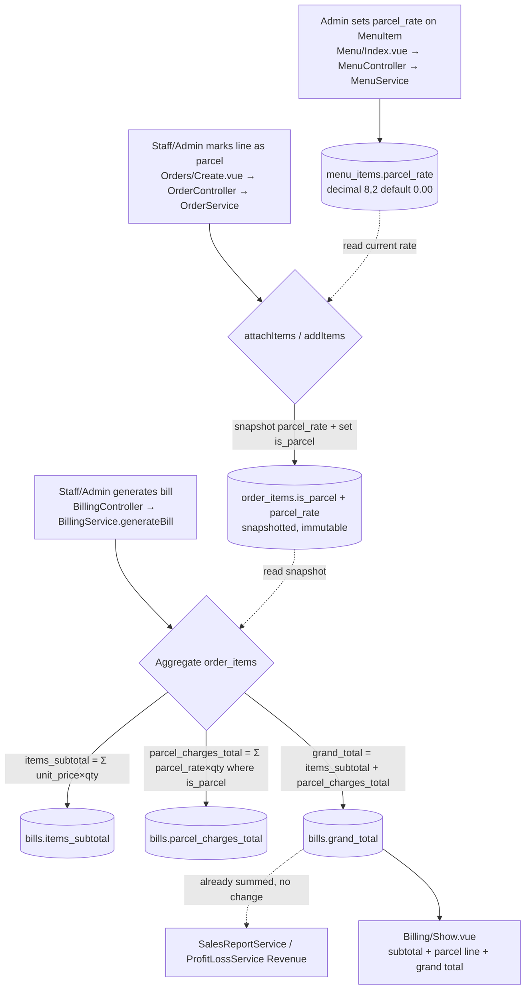
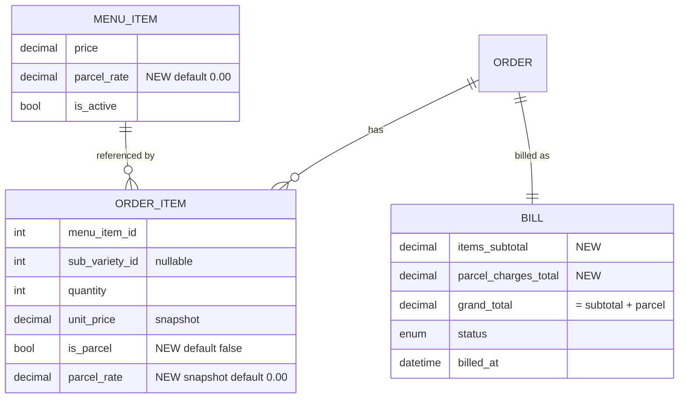

# Design Document: Parcel Charges

## Overview

Parcel Charges add an optional, per-unit take-away fee to the WhiteJersey Cafe POS. The fee is configured per menu item (admin-only), applied per order line (staff or admin, dine-in and parcel lines can mix on one order), and surfaced on the bill as a distinct line between the items subtotal and the grand total. Because the grand total already flows into Sales and Profit & Loss reporting, parcel charges are automatically reflected in revenue with no reporting changes.

The design extends the existing Service + Interface architecture without introducing new services, bindings, or tables. It adds three columns via alter-migrations, threads a `parcel_rate` value through the existing menu → order-item → bill data path, and snapshots the rate onto the order item at add time so later menu edits do not change historical orders. This mirrors the existing `unit_price` snapshot pattern exactly.

Key design principles carried over from the codebase:

- **Service-layer validation** throwing `Illuminate\Validation\ValidationException` (accumulate `$errors`, throw once). Controller `$request->validate(...)` remains the first-line HTTP validation.
- **Money as decimal**, computed as float and rounded with `round($x, 2)`; decimal columns cast `decimal:2`.
- **Snapshot immutability**: values needed for billing are copied onto the order item at creation time.
- **Admin-only pricing**: menu management endpoints already sit behind the `admin` middleware group; order-taking and billing remain open to staff + admin. No routing changes are needed.
- **Backward compatibility via defaults**: `menu_items.parcel_rate` defaults to `0.00`, `order_items.is_parcel` defaults to `false`, so existing rows behave as dine-in with no charge.

### Requirements Coverage Summary

| Requirement | Addressed by |
|---|---|
| 1 — Set/validate per-item parcel rate | MenuService `validateItemData` + create/update; MenuController validation |
| 2 — Mark order lines as parcel | OrderService `attachItems`/`addItems` snapshot + `is_parcel`; OrderController validation |
| 3 — Per-unit parcel charge calculation | BillingService `generateBill` parcel charge math |
| 4 — Bill with separate parcel line | BillingService stores `items_subtotal`, `parcel_charges_total`, `grand_total` |
| 5 — Display parcel indicators/line | BillingController `formatBill` + Billing/Show.vue |
| 6 — Reflect in revenue/reports | No change to reports (grand_total already summed); `parcel_charges_total` stored for future breakdown |
| 7 — Backward compatibility/defaults | Column defaults + cast defaults + optional request fields |
| 8 — Admin-only rate editing | Existing `admin` middleware group on menu routes |

## Architecture

Parcel rate is configured once on the menu item, snapshotted onto each order line at add time, then aggregated at billing. The snapshot is the crucial link: it decouples historical orders from later menu edits.



Data-path ownership:

- **MenuService** owns validation and persistence of `parcel_rate`.
- **OrderService** owns reading the *current* menu rate and snapshotting it onto the order item together with the `is_parcel` flag, and owns the merge-identity rule.
- **BillingService** owns aggregation and the three bill totals.
- **Reports** own nothing new — they read `grand_total` as before.

## Components and Interfaces

No interface signatures change. `createItem`/`updateItem`/`createOrder`/`addItems`/`generateBill` keep their current signatures; the new data travels inside the existing `array $data` / `array $items` parameters and onto the models. This keeps the `Contracts/*Interface.php` files untouched and requires no new `DomainServiceProvider` bindings.

### 1. Migrations (dependency order — apply before model/service changes)

Three additive alter-migrations. SQLite handles `ALTER TABLE ... ADD COLUMN` natively, so no table rebuild is required. Each new column is nullable-safe by carrying a default, so existing rows populate correctly.

- **`2024_01_01_000011_add_parcel_rate_to_menu_items.php`**
  - `up`: `$table->decimal('parcel_rate', 8, 2)->default(0.00)->after('price');`
  - `down`: `$table->dropColumn('parcel_rate');`
- **`2024_01_01_000012_add_parcel_to_order_items.php`**
  - `up`: `$table->boolean('is_parcel')->default(false)->after('unit_price');` then `$table->decimal('parcel_rate', 8, 2)->default(0.00)->after('is_parcel');`
  - `down`: `$table->dropColumn(['is_parcel', 'parcel_rate']);`
- **`2024_01_01_000013_add_parcel_charges_to_bills.php`**
  - `up`: `$table->decimal('items_subtotal', 10, 2)->default(0)->after('grand_total');` then `$table->decimal('parcel_charges_total', 10, 2)->default(0)->after('items_subtotal');`
  - `down`: `$table->dropColumn(['items_subtotal', 'parcel_charges_total']);`

> Note on `down()` for SQLite: dropping multiple columns in one `dropColumn([...])` triggers a table rebuild on older SQLite; Laravel 11 handles this. Since tests use in-memory SQLite with `RefreshDatabase` (fresh migrate each run), rollback is not exercised in the test path, but the `down()` methods are provided for completeness.

### 2. Models

- **MenuItem** — add `'parcel_rate'` to `$fillable`; add `'parcel_rate' => 'decimal:2'` to `casts()`.
- **OrderItem** — add `'is_parcel'` and `'parcel_rate'` to `$fillable`; add `'is_parcel' => 'boolean'` and `'parcel_rate' => 'decimal:2'` to `casts()`.
- **Bill** — add `'items_subtotal'` and `'parcel_charges_total'` to `$fillable`; add both as `'decimal:2'` in `casts()`.

### 3. MenuService

Extend `validateItemData(array $data): array` to validate an optional `parcel_rate`, mirroring the existing `price_adjustment` pattern in `createSubVariety`:

```php
// Validate optional parcel_rate (default 0.00 when omitted)
if (array_key_exists('parcel_rate', $data) && $data['parcel_rate'] !== null && $data['parcel_rate'] !== '') {
    if (!is_numeric($data['parcel_rate'])) {
        $errors['parcel_rate'] = ['The parcel rate must be a numeric value.'];
    } elseif ((float) $data['parcel_rate'] < 0.00 || (float) $data['parcel_rate'] > 9999.99) {
        $errors['parcel_rate'] = ['The parcel rate must be between 0.00 and 9999.99.'];
    }
    $data['parcel_rate'] = $data['parcel_rate'];
} else {
    $data['parcel_rate'] = 0.00; // default (Req 1.3, 7.1)
}
```

Then persist it:

- `createItem`: add `'parcel_rate' => $data['parcel_rate'],` to the `MenuItem::create([...])` payload.
- `updateItem`: add `'parcel_rate' => $data['parcel_rate'],` to the `$menuItem->update([...])` payload.

`0.00` is a valid value meaning "no charge" (Req 1.6). The range check `>= 0.00` naturally admits it.

### 4. OrderService

The `items` array element gains an optional `'is_parcel' => bool` (default `false`). `validateItems` needs no new rule (the boolean is optional and defaulted; HTTP validation covers type). Update docblock `@param` lines on `createOrder`, `addItems`, `attachItems` to document the new key.

Add a private helper mirroring `resolveUnitPrice`:

```php
/**
 * Resolve the current parcel rate for a menu item (snapshotted onto the order item).
 */
private function resolveParcelRate(int $menuItemId): string
{
    $menuItem = MenuItem::findOrFail($menuItemId);
    return number_format((float) $menuItem->parcel_rate, 2, '.', '');
}
```

`attachItems` — snapshot both values when creating each line:

```php
$isParcel  = (bool) ($item['is_parcel'] ?? false);
$unitPrice = $this->resolveUnitPrice($menuItemId, $subVarietyId);
$parcelRate = $this->resolveParcelRate($menuItemId);

$order->orderItems()->create([
    'menu_item_id'   => $menuItemId,
    'sub_variety_id' => $subVarietyId,
    'quantity'       => $quantity,
    'unit_price'     => $unitPrice,
    'is_parcel'      => $isParcel,
    'parcel_rate'    => $parcelRate,
]);
```

`addItems` — the merge identity now includes `is_parcel`, so a parcel line and a dine-in line of the same item+sub-variety stay **separate** (Req 2.5):

```php
$isParcel = (bool) ($item['is_parcel'] ?? false);

$existingItem = $order->orderItems()
    ->where('menu_item_id', $menuItemId)
    ->where('sub_variety_id', $subVarietyId)
    ->where('is_parcel', $isParcel)   // ← parcel flag is part of line identity
    ->first();

if ($existingItem) {
    $existingItem->update(['quantity' => $existingItem->quantity + $quantity]);
} else {
    $order->orderItems()->create([
        'menu_item_id'   => $menuItemId,
        'sub_variety_id' => $subVarietyId,
        'quantity'       => $quantity,
        'unit_price'     => $this->resolveUnitPrice($menuItemId, $subVarietyId),
        'is_parcel'      => $isParcel,
        'parcel_rate'    => $this->resolveParcelRate($menuItemId),
    ]);
}
```

The snapshot is never re-read after creation, so a later `menu_items.parcel_rate` change does not affect existing order items (Req 2.7). Marking a line parcel when the menu rate is `0.00` produces `is_parcel = true, parcel_rate = 0.00` (Req 2.8) — valid and charges nothing.

### 5. BillingService

`generateBill` changes the calculation block only (idempotency, order lookup, order/table status transitions all unchanged):

```php
$itemsSubtotal = $order->orderItems->sum(
    fn ($item) => (float) $item->unit_price * $item->quantity
);

$parcelChargesTotal = $order->orderItems->sum(
    fn ($item) => $item->is_parcel
        ? (float) $item->parcel_rate * $item->quantity
        : 0.0
);

$itemsSubtotal      = round($itemsSubtotal, 2);
$parcelChargesTotal = round($parcelChargesTotal, 2);
$grandTotal         = round($itemsSubtotal + $parcelChargesTotal, 2);

$bill = Bill::create([
    'order_id'             => $order->id,
    'table_id'             => $tableId,
    'items_subtotal'       => $itemsSubtotal,
    'parcel_charges_total' => $parcelChargesTotal,
    'grand_total'          => $grandTotal,
    'status'               => BillStatus::Unpaid,
    'billed_at'            => now(),
]);
```

An all-dine-in order yields `parcel_charges_total = 0.00` and `grand_total = items_subtotal` (Req 4.6, 7.3). `settleBill` and `getBillForTable` are unchanged.

### 6. Controllers

**OrderController** — add the optional parcel flag to both `store` and `addItems` validation:

```php
'items.*.is_parcel' => 'nullable|boolean',
```

(existing rules for `menu_item_id`, `quantity`, `sub_variety_id` unchanged). The validated array carries `is_parcel` per item into the service.

**MenuController** — add to both `store` and `update`:

```php
'parcel_rate' => 'nullable|numeric|min:0|max:9999.99',
```

No route change: menu routes are already inside `Route::middleware('admin')`, so staff attempts return 403 and unauthenticated requests redirect to login (Req 8.1, 8.5). The order-create screen already receives active menu items via `menuService->getActiveItems()`; since `parcel_rate` is now fillable/cast on MenuItem, it is serialized to the Inertia payload automatically for the UI preview.

**BillingController** — extend `formatBill` to expose per-line and top-level parcel data:

```php
private function formatBill($bill): array
{
    return [
        'id'                   => $bill->id,
        'items_subtotal'       => $bill->items_subtotal,
        'parcel_charges_total' => $bill->parcel_charges_total,
        'grand_total'          => $bill->grand_total,
        'status'               => $bill->status instanceof \BackedEnum ? $bill->status->value : $bill->status,
        'billed_at'            => $bill->billed_at->toIso8601String(),
        'order'                => [
            'id'          => $bill->order->id,
            'order_items' => $bill->order->orderItems->map(fn ($item) => [
                'id'                => $item->id,
                'quantity'          => $item->quantity,
                'unit_price'        => $item->unit_price,
                'is_parcel'         => (bool) $item->is_parcel,
                'parcel_rate'       => $item->parcel_rate,
                'parcel_line_total' => $item->is_parcel
                    ? round((float) $item->parcel_rate * $item->quantity, 2)
                    : 0.0,
                'menu_item'         => ['name' => $item->menuItem?->name ?? 'Unknown'],
            ])->values()->toArray(),
        ],
    ];
}
```

### 7. Frontend (rebuilt inside Docker — see Verification)

- **Menu/Index.vue** — add a "Parcel Rate (₹)" number input (`step="0.01" min="0" max="9999.99"`) to the create/edit menu-item form, bound to a `parcel_rate` form field (default `0`). Display the parcel rate on item rows (e.g. a small "Parcel ₹X.XX" tag when `parcel_rate > 0`). Follow the existing black/red theme classes.
- **Orders/Create.vue** — the current UI tracks only a quantity per menu item. Extend the per-item selection so each selected item also carries a `is_parcel` boolean via a per-line "Parcel" toggle/checkbox rendered next to the quantity stepper. The submitted `items` payload gains `is_parcel: <bool>` per line. Optionally show a per-line preview `parcel_rate × qty` using the `parcel_rate` now present in the `menuItems` payload. Because a dine-in and a parcel selection of the same item must stay separate lines, the selection state keys on `menu_item_id + is_parcel` (a menu item can appear as both a dine-in qty and a parcel qty).
- **Billing/Show.vue** — add a "Parcel" tag on rows where `item.is_parcel`, show the line parcel charge (`item.parcel_line_total`), and replace the single Grand Total block with three rows: **Items Subtotal** (`bill.items_subtotal`), **Parcel Charges** (`bill.parcel_charges_total`), and **Grand Total** (`bill.grand_total`). Keep the existing print styles and theme.

### 8. Reports & Service Provider

- **SalesReportService / ProfitLossService**: no changes. Both sum `bills.grand_total`, which now already includes parcel charges (Req 6.2, 6.3). `parcel_charges_total` is stored on each bill so a future report can break out the parcel portion without re-deriving it (Req 6.4).
- **DomainServiceProvider**: no new bindings — all changes extend existing bound services.

## Data Models

New/changed columns (additive only):

| Table | Column | Type | Default | Notes |
|---|---|---|---|---|
| `menu_items` | `parcel_rate` | `decimal(8,2)` | `0.00` | Per-unit take-away fee; 0.00 = no charge. Cast `decimal:2`. |
| `order_items` | `is_parcel` | `boolean` | `false` | Parcel flag; part of merge identity. Cast `boolean`. |
| `order_items` | `parcel_rate` | `decimal(8,2)` | `0.00` | Snapshot of menu rate at add time. Cast `decimal:2`. |
| `bills` | `items_subtotal` | `decimal(10,2)` | `0` | Σ unit_price × qty. Cast `decimal:2`. |
| `bills` | `parcel_charges_total` | `decimal(10,2)` | `0` | Σ parcel_rate × qty where is_parcel. Cast `decimal:2`. |

Entity relationships (only affected columns shown):



**Order-item line identity**: `(menu_item_id, sub_variety_id, is_parcel)`. Two selections of the same menu item + sub-variety merge only when their parcel flags match; otherwise they remain distinct lines.

## Correctness Properties

*A property is a characteristic or behavior that should hold true across all valid executions of a system — essentially, a formal statement about what the system should do. Properties serve as the bridge between human-readable specifications and machine-verifiable correctness guarantees.*

The parcel-charges logic is well suited to property-based testing: menu-rate validation, order-line snapshotting, and bill aggregation are pure input/output transformations with universal invariants over a large input space (rates, quantities, parcel/dine-in mixes). Each property below is derived from the prework analysis and consolidates redundant acceptance criteria.

### Property 1: Valid parcel rate is persisted with two-decimal precision

*For any* menu item and *any* parcel rate value in the inclusive range 0.00 to 9999.99, creating or updating the menu item with that rate results in a stored `parcel_rate` equal to the input rounded to two decimal places.

**Validates: Requirements 1.1, 1.2, 1.6**

### Property 2: Out-of-range or non-numeric parcel rate is rejected

*For any* parcel rate value that is either non-numeric or numerically less than 0.00 or greater than 9999.99, creating or updating a menu item with that value is rejected with a `ValidationException` carrying a `parcel_rate` error message, and no menu item rate is persisted from that submission.

**Validates: Requirements 1.4, 1.5**

### Property 3: Order line preserves the submitted parcel flag

*For any* set of order lines submitted through order creation or item addition, each stored order item's `is_parcel` equals the flag submitted for that line, defaulting to false when no flag was provided.

**Validates: Requirements 2.1, 2.2, 2.3, 2.4, 7.2, 7.5**

### Property 4: Order item snapshots the menu item's current parcel rate

*For any* menu item with parcel rate R at the time a line is added, the resulting order item's snapshotted `parcel_rate` equals R (including R = 0.00 when the line is marked parcel).

**Validates: Requirements 2.6, 2.8, 7.1**

### Property 5: Snapshotted parcel rate is immutable under later menu edits

*For any* existing order item and *any* subsequent change to the referenced menu item's parcel rate, the order item's snapshotted `parcel_rate` remains unchanged.

**Validates: Requirements 2.7**

### Property 6: Merge keeps parcel and dine-in lines of the same item separate

*For any* menu item (and optional sub-variety) added to an order both as a dine-in line and as a parcel line, the order retains two distinct order items whose `is_parcel` flags differ; only lines matching on `(menu_item_id, sub_variety_id, is_parcel)` are merged by summing quantity.

**Validates: Requirements 2.5**

### Property 7: Per-line parcel charge equals rate times quantity, zero for dine-in

*For any* order item, its parcel charge equals `round(parcel_rate × quantity, 2)` when `is_parcel` is true and exactly 0.00 when `is_parcel` is false.

**Validates: Requirements 3.1, 3.2, 3.4**

### Property 8: Parcel charges total equals the sum of per-line parcel charges

*For any* order, the bill's `parcel_charges_total` equals the two-decimal-rounded sum of the per-line parcel charges across all order items (only parcel lines contribute).

**Validates: Requirements 3.3, 4.2**

### Property 9: Grand total equals items subtotal plus parcel charges total

*For any* order, the bill's `grand_total` equals `round(items_subtotal + parcel_charges_total, 2)`, where `items_subtotal` equals the rounded sum of `unit_price × quantity` across all order items.

**Validates: Requirements 4.1, 4.3, 4.5, 6.1**

### Property 10: A dine-in-only order has zero parcel charges and grand total equal to subtotal

*For any* order whose order items are all dine-in lines, the bill's `parcel_charges_total` is 0.00 and its `grand_total` equals its `items_subtotal`.

**Validates: Requirements 4.6, 7.3**

## Error Handling

The feature follows the codebase's established error strategy; no new exception types are introduced.

- **Service-layer validation (MenuService)**: `validateItemData` accumulates errors into an `$errors` array and throws a single `Illuminate\Validation\ValidationException` via `withMessages($errors)`. The `parcel_rate` rules (numeric; 0.00–9999.99) join the existing name/price/category checks so a submission reports all problems at once. Omitted or empty `parcel_rate` is not an error — it defaults to `0.00`.
- **HTTP validation (controllers)**: `MenuController` adds `'parcel_rate' => 'nullable|numeric|min:0|max:9999.99'`; `OrderController` adds `'items.*.is_parcel' => 'nullable|boolean'`. These reject malformed requests before the service runs and produce Inertia validation-error responses that the Vue forms already surface.
- **Authorization errors**: menu-management routes remain inside the `admin` middleware group — a staff user receives HTTP 403 and an unauthenticated request is redirected to login. No new authorization logic is written (Req 8.1, 8.2, 8.5).
- **Billing lookups**: `generateBill` keeps its existing `NotFoundHttpException` for a missing order and its idempotent early-return when an order is already billed. The added total calculations operate on the already-loaded `orderItems` collection and introduce no new failure modes.
- **Numeric safety**: charges are computed as `float` then `round(..., 2)`; decimal casts on the models ensure consistent two-decimal serialization. A `parcel_rate` of `0.00` on a parcel line is valid and contributes `0.00`.

## Testing Strategy

Tests run through `./test.sh` (Pest, in-memory SQLite, `RefreshDatabase`). The approach is dual: property-based tests for the universal invariants above, and example/integration tests for defaulting, authorization, and reporting wiring.

### Factory updates

- **MenuItemFactory**: add `'parcel_rate' => fake()->randomFloat(2, 0, 9999.99)` and a `withoutParcelRate()` / `parcelRate($r)` state helper for targeted cases (and a `0.00` default state to exercise backward-compat).
- **OrderItemFactory**: add `'is_parcel' => false` and `'parcel_rate' => 0.00` to the default definition, plus a `parcel(float $rate)` state that sets `is_parcel => true` and a matching `parcel_rate`.
- **BillFactory**: add `'items_subtotal'` and `'parcel_charges_total'` consistent with `grand_total` (e.g. subtotal + parcel = grand_total) so factory-built bills stay internally consistent.

### Property-based tests

Use a PHP property-based testing approach layered on Pest (a generator-driven `it(...)->with([...])` dataset producing ≥100 randomized cases per property, or an equivalent PBT helper). Do not hand-roll generation logic beyond input construction. Each property test runs a **minimum of 100 iterations** and is tagged with a comment referencing the design property:

```
// Feature: parcel-charges, Property 9: grand_total = items_subtotal + parcel_charges_total
```

Implement each of Properties 1–10 as a **single** property-based test:

- **P1** — random valid rates → `MenuService::createItem`/`updateItem`; assert stored `parcel_rate` == `round(input, 2)`.
- **P2** — random non-numeric strings and out-of-range numbers → assert `ValidationException` with `parcel_rate` key; assert nothing persisted. (Generators cover the non-numeric edge cases from Req 1.4.)
- **P3** — random line sets with random `is_parcel` flags (and omitted flags) via `createOrder` and `addItems`; assert stored `is_parcel` matches submitted/default.
- **P4** — random menu `parcel_rate` (including 0.00); add a line; assert order item `parcel_rate` == menu rate at add time.
- **P5** — add a line, then mutate the menu item's `parcel_rate` to a different random value; assert the order item's `parcel_rate` is unchanged.
- **P6** — add the same menu item once dine-in and once parcel via `addItems`; assert two distinct lines with differing flags; assert same-flag re-adds merge quantities.
- **P7** — random `parcel_rate` and `quantity`, random flag; assert per-line charge == `is_parcel ? round(rate*qty, 2) : 0.00`.
- **P8** — random orders; assert `parcel_charges_total` == rounded sum of per-line parcel charges.
- **P9** — random orders; assert `grand_total` == `round(items_subtotal + parcel_charges_total, 2)` and `items_subtotal` == rounded sum of `unit_price*qty`.
- **P10** — random dine-in-only orders; assert `parcel_charges_total` == 0.00 and `grand_total` == `items_subtotal`.

### Example and edge-case unit/feature tests

- Defaults: create menu item with no `parcel_rate` → stored `0.00` (Req 1.3, 7.1, 7.4); create order item with no flag → `is_parcel` false (Req 7.2, 7.5).
- Boundary: `parcel_rate` exactly `0.00` and `9999.99` accepted; just outside rejected (complements P1/P2 generators).
- `formatBill` payload: includes per-line `is_parcel`, `parcel_rate`, `parcel_line_total`, and top-level `items_subtotal`, `parcel_charges_total`, `grand_total`; parcel-free order shows `parcel_charges_total` 0.00 (Req 5.1–5.4, 6.4).

### Authorization tests

- Staff `POST /menu` or `PUT /menu/{id}` with `parcel_rate` → 403 (Req 8.1).
- Admin `POST`/`PUT /menu` with `parcel_rate` → success (Req 8.2).
- Staff creates an order with a parcel line and generates/settles a bill that includes parcel charges → success (Req 8.3, 8.4).
- Unauthenticated `POST /menu` → redirect to login (Req 8.5).

### Integration tests (reporting wiring)

- Generate 1–2 paid bills that include parcel charges, then assert `SalesReportService` revenue and `ProfitLossService` revenue for the period include the parcel portion (grand totals already summed). 1–3 representative examples suffice — behavior does not vary meaningfully with input, so PBT is not used here (Req 6.2, 6.3).

### Verification note (Docker rebuild)

The frontend is built inside the Docker image with no source bind-mount, so Vue changes to `Menu/Index.vue`, `Orders/Create.vue`, and `Billing/Show.vue` are only visible after rebuilding the image. Backend/PHP tests via `./test.sh` do not require a rebuild. After implementation, run `./test.sh` to confirm all property, example, authorization, and integration tests pass, and rebuild the Docker image to verify the UI changes manually.
