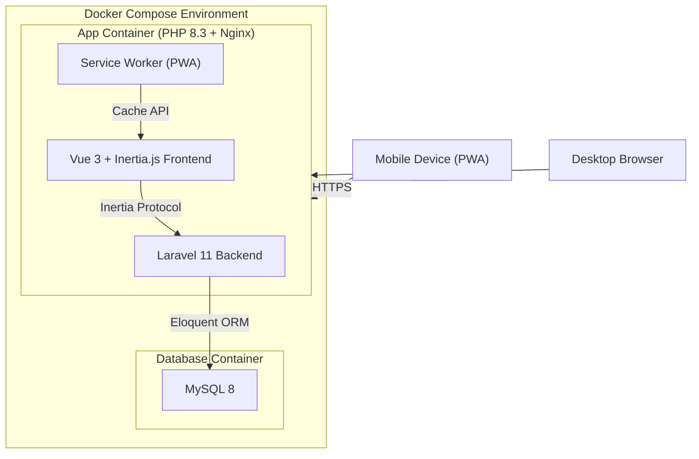
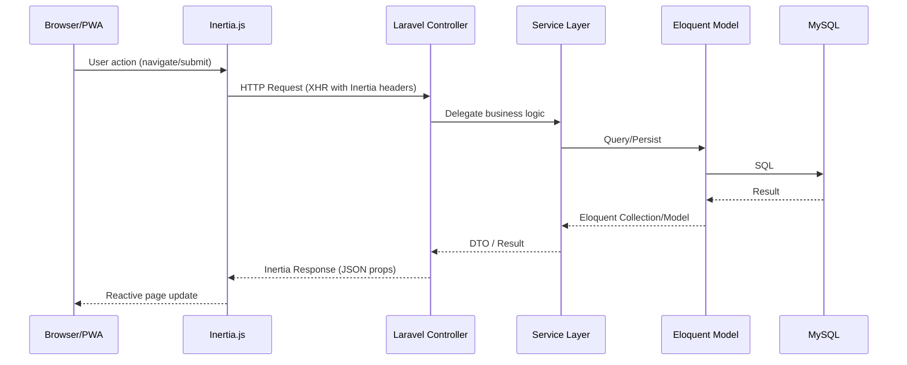
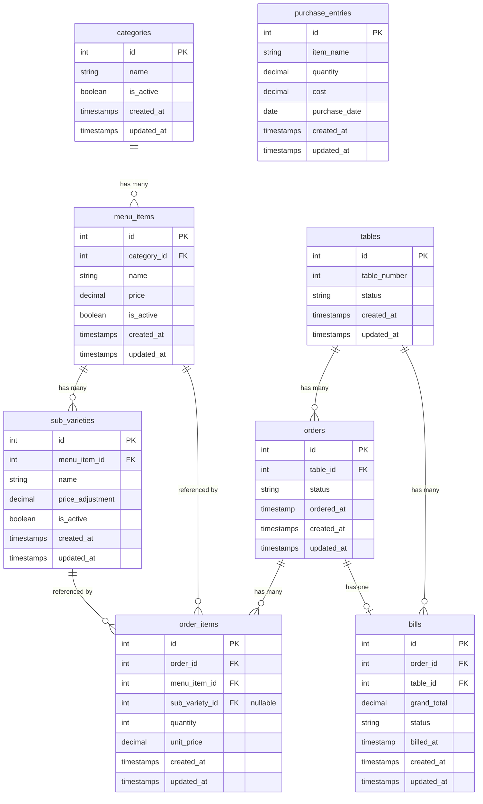

# Design Document: WhiteJersey Cafe POS

## Overview

WhiteJersey Cafe POS is a full-featured point-of-sale and business management system built with Laravel (backend API), a Vue.js + Inertia.js frontend, MySQL for persistence, and Docker for containerized deployment. The application is delivered as a Progressive Web App (PWA) with a black and red UI theme matching the WhiteJersey Cafe brand.

The system covers six core business domains:
1. **Menu Management** — CRUD for items, categories, and sub-varieties
2. **Order Management** — Table-linked order creation, item additions, status tracking
3. **Billing** — Bill generation, settlement, and display
4. **Sales Reporting** — Daily/weekly/monthly/yearly revenue and popularity analytics
5. **Inventory Tracking** — Purchase entry recording and spending summaries
6. **Profit/Loss Reporting** — Revenue vs. spending comparisons across time periods

### Key Design Decisions

| Decision | Choice | Rationale |
|----------|--------|-----------|
| Backend framework | Laravel 11 | Mature PHP framework with built-in ORM, migrations, validation, and testing support. Project is named `wj-cafe-laravel`. |
| Frontend framework | Vue 3 + Inertia.js | SPA-like experience without a separate API layer; ships as a monolith. PWA-friendly. |
| Database | MySQL 8 | Reliable relational DB, well-supported by Laravel/Eloquent. |
| Containerization | Docker Compose | Single-command startup with app + database services. |
| PWA tooling | Vite PWA plugin (`vite-plugin-pwa`) | Generates service worker and manifest automatically during build. |
| CSS approach | Tailwind CSS | Utility-first; makes theming and responsive design straightforward. |
| Testing (unit/feature) | PHPUnit + Pest | Laravel default; Pest provides expressive syntax. |
| Testing (property) | Pest + custom generators | Property-based testing via Pest's data providers with randomized inputs. |

---

## Architecture



### Request Flow



### Layer Responsibilities

| Layer | Responsibility |
|-------|---------------|
| **Controllers** | HTTP concerns: request validation, authorization, response formatting |
| **Services** | Business logic: calculations, rules, orchestration |
| **Models** | Data access: relationships, scopes, attribute casting |
| **Repositories** (optional) | Complex queries requiring raw SQL or multi-model aggregation |

---

## Components and Interfaces

### Backend Components

#### MenuService

```php
interface MenuServiceInterface
{
    public function createItem(array $data): MenuItem;
    public function updateItem(int $id, array $data): MenuItem;
    public function deactivateItem(int $id): void;
    public function listByCategory(): Collection; // grouped by category with sub-varieties
    public function getActiveItems(): Collection;
}
```

#### OrderService

```php
interface OrderServiceInterface
{
    public function createOrder(int $tableId, array $items): Order;
    public function addItems(int $orderId, array $items): Order;
    public function getOpenOrderForTable(int $tableId): ?Order;
    public function getTableOverview(): Collection; // tables with status
}
```

#### BillingService

```php
interface BillingServiceInterface
{
    public function generateBill(int $tableId): Bill;
    public function settleBill(int $billId): Bill;
    public function getBillForTable(int $tableId): ?Bill;
}
```

#### SalesReportService

```php
interface SalesReportServiceInterface
{
    public function dailyReport(Carbon $date): SalesReportDTO;
    public function weeklyReport(Carbon $startDate): SalesReportDTO;
    public function monthlyReport(int $year, int $month): SalesReportDTO;
    public function yearlyReport(int $year): SalesReportDTO;
}
```

#### InventoryService

```php
interface InventoryServiceInterface
{
    public function recordPurchase(array $data): PurchaseEntry;
    public function dailySpending(Carbon $date): DailySpendingDTO;
    public function monthlySpending(int $year, int $month): MonthlySpendingDTO;
}
```

#### ProfitLossService

```php
interface ProfitLossServiceInterface
{
    public function weeklyReport(Carbon $startDate): ProfitLossDTO;
    public function monthlyReport(int $year, int $month): ProfitLossDTO;
    public function yearlyReport(int $year): ProfitLossDTO;
}
```

### Frontend Components (Vue 3)

| Component | Purpose |
|-----------|---------|
| `MenuManager.vue` | CRUD interface for menu items and categories |
| `OrderScreen.vue` | Table selection + item ordering interface |
| `TableOverview.vue` | Grid display of all tables with status indicators |
| `BillView.vue` | Bill display with itemized breakdown |
| `SalesReport.vue` | Filterable report with period selection and charts |
| `InventoryEntry.vue` | Purchase recording form |
| `ProfitLossReport.vue` | P&L statement display with period selection |
| `AppLayout.vue` | Shell layout with black/red themed navigation |

### PWA Components

| Component | Purpose |
|-----------|---------|
| `manifest.json` | App name, icons, theme colors, display mode |
| `service-worker.js` | Precaching of app shell, offline fallback, background sync |
| `OfflineIndicator.vue` | Visual banner when connectivity is lost |

---

## Data Models



### Key Model Attributes

| Model | Field | Type | Constraints |
|-------|-------|------|-------------|
| `MenuItem` | name | string | 1-100 chars, unique within category |
| `MenuItem` | price | decimal(8,2) | 0.01 - 99,999.99 |
| `SubVariety` | name | string | 1-100 chars |
| `SubVariety` | price_adjustment | decimal(8,2) | nullable, default 0.00 |
| `Order` | status | enum | `active`, `billed`, `completed` |
| `OrderItem` | quantity | integer | 1-99 |
| `OrderItem` | unit_price | decimal(8,2) | Snapshot of price at order time |
| `Bill` | grand_total | decimal(10,2) | Calculated sum |
| `Bill` | status | enum | `unpaid`, `paid` |
| `PurchaseEntry` | item_name | string | 1-100 chars |
| `PurchaseEntry` | quantity | decimal(10,3) | > 0 |
| `PurchaseEntry` | cost | decimal(10,2) | 0.01 - 999,999.99 |
| `PurchaseEntry` | purchase_date | date | <= today |
| `Table` | status | enum | `vacant`, `occupied` |

### DTOs

```php
class SalesReportDTO
{
    public function __construct(
        public readonly float $totalRevenue,
        public readonly int $totalOrders,
        public readonly array $itemSales,   // [{name, quantity_sold, revenue}]
        public readonly array $topItems,    // top 5 by quantity
        public readonly string $periodLabel,
    ) {}
}

class ProfitLossDTO
{
    public function __construct(
        public readonly float $totalEarnings,
        public readonly float $totalSpending,
        public readonly float $netAmount,
        public readonly string $status,      // 'profit' | 'loss' | 'break-even'
        public readonly string $periodLabel,
    ) {}
}

class DailySpendingDTO
{
    public function __construct(
        public readonly Carbon $date,
        public readonly array $entries,     // [{item_name, quantity, cost}]
        public readonly float $totalCost,
    ) {}
}

class MonthlySpendingDTO
{
    public function __construct(
        public readonly int $year,
        public readonly int $month,
        public readonly array $itemTotals,  // [{item_name, total_cost}]
        public readonly float $grandTotal,
    ) {}
}
```

---

## Correctness Properties

*A property is a characteristic or behavior that should hold true across all valid executions of a system — essentially, a formal statement about what the system should do. Properties serve as the bridge between human-readable specifications and machine-verifiable correctness guarantees.*

### Property 1: Menu item persistence round-trip

*For any* valid menu item data (name 1-100 chars, price 0.01-99999.99, valid category), creating or updating a menu item and then retrieving it should produce an item with identical name, price, and category values.

**Validates: Requirements 1.1, 1.2**

### Property 2: Menu item validation accepts valid and rejects invalid

*For any* menu item input, the system should accept it if and only if: the trimmed name is between 1 and 100 characters, the price is between 0.01 and 99,999.99, and the category is from the available categories list. Invalid inputs should be rejected with field-specific error messages.

**Validates: Requirements 1.4, 1.5**

### Property 3: Sub-variety association

*For any* valid menu item and valid sub-variety data (name 1-100 chars, optional price adjustment), associating the sub-variety with the menu item should result in the sub-variety appearing in the item's sub-varieties collection under the correct parent category.

**Validates: Requirements 1.3**

### Property 4: Deactivated items hidden from active listing

*For any* menu item that has been deactivated, querying the active menu items list should not include that item, but querying historical order records that reference it should still return the item data.

**Validates: Requirements 1.6**

### Property 5: Duplicate name rejection within category

*For any* category and any menu item name that already exists within that category, attempting to create a new item with the same name in the same category should be rejected.

**Validates: Requirements 1.9**

### Property 6: At most one open order per table

*For any* table, after any sequence of order creation operations, there should be at most one order with "active" status associated with that table at any point in time.

**Validates: Requirements 2.1**

### Property 7: Order item quantity aggregation

*For any* open order and any sequence of item additions (including duplicates), the final quantity for each distinct menu item should equal the sum of all quantities added for that item across all additions.

**Validates: Requirements 2.2**

### Property 8: Order item quantity validation

*For any* integer quantity value, the system should accept it if and only if it is between 1 and 99 inclusive. Values outside this range should be rejected with a validation error.

**Validates: Requirements 2.3, 2.6**

### Property 9: Table overview reflects actual state

*For any* configuration of tables and their associated orders, the table overview should report each table's status as "occupied" if it has an active or billed order, and "vacant" otherwise.

**Validates: Requirements 2.7**

### Property 10: Bill calculation correctness

*For any* set of order items with prices (decimal, 2 places) and quantities (integer 1-99), the bill grand total should equal the sum of (unit_price × quantity) for each line item, with each line total and the grand total rounded to exactly two decimal places.

**Validates: Requirements 3.1**

### Property 11: Bill contains all required fields

*For any* generated bill, the bill output should include: a unique bill identifier, the table number, the date and time of billing, and for each line item: the item name, quantity, unit price, and line total, plus the grand total.

**Validates: Requirements 3.2, 3.7**

### Property 12: Bill generation is idempotent

*For any* order already in "billed" status, requesting a bill for that table should return the same bill (same identifier, same total) without creating a new bill record.

**Validates: Requirements 3.4**

### Property 13: Billed orders reject further additions

*For any* order that has been billed, attempting to add items to that order should be rejected and the order's items and total should remain unchanged.

**Validates: Requirements 3.3**

### Property 14: Bill settlement frees the table

*For any* bill that is settled, the associated order's status should become "completed" and the associated table's status should become "vacant", allowing new orders on that table.

**Validates: Requirements 3.5**

### Property 15: Sales report aggregation correctness

*For any* set of completed orders within a given time period (day, week, month, or year), the sales report's total revenue should equal the sum of all bill grand totals in that period, and total orders should equal the count of distinct completed orders in that period.

**Validates: Requirements 4.1, 4.2, 4.3, 4.4, 4.6**

### Property 16: Sales popularity ranking

*For any* set of completed orders within a reporting period, the "most popular dishes" list should contain at most 5 items, ordered by total quantity sold descending, with no item outside the top 5 having a higher quantity than any item in the list.

**Validates: Requirements 4.5**

### Property 17: Purchase entry persistence round-trip

*For any* valid purchase entry data (non-empty name ≤100 chars, quantity > 0, cost 0.01-999999.99, date ≤ today), creating the entry and retrieving it should produce a record with identical attribute values.

**Validates: Requirements 5.1**

### Property 18: Inventory spending aggregation

*For any* set of purchase entries, the daily spending total for a given date should equal the sum of all entry costs on that date, and the monthly spending per item should equal the sum of costs for that item within the month.

**Validates: Requirements 5.3, 5.4**

### Property 19: Purchase entry validation

*For any* purchase entry input, the system should accept it if and only if: the item name is non-empty and at most 100 characters, quantity is greater than zero, cost is between 0.01 and 999,999.99, and the date is not in the future. Invalid inputs should be rejected with field-specific errors.

**Validates: Requirements 5.5, 5.6**

### Property 20: Profit/Loss calculation

*For any* time period (week, month, or year), the profit/loss net amount should equal (total sales revenue for the period) minus (total inventory spending for the period), where revenue is the sum of all bill grand totals and spending is the sum of all purchase entry costs within that period.

**Validates: Requirements 6.1, 6.2, 6.3**

### Property 21: Profit/Loss monetary formatting

*For any* profit/loss report values (earnings, spending, net amount), all monetary values should be formatted to exactly 2 decimal places and include a currency symbol.

**Validates: Requirements 6.4**

### Property 22: Profit/Loss status labeling

*For any* profit/loss net amount, the status should be "profit" when the net amount is positive, "loss" when negative, and "break-even" when zero.

**Validates: Requirements 6.5, 6.6**

---

## Error Handling

### Validation Errors

| Context | Strategy |
|---------|----------|
| Menu item creation/update | Return 422 with per-field error messages; preserve form data on client |
| Order item quantity | Return 422 with message specifying allowed range (1-99) |
| Purchase entry | Return 422 with per-field error messages |
| Table selection missing | Return 422 with message requiring table selection |
| Duplicate menu item name | Return 422 with conflict message specifying the duplicate name |

### Business Logic Errors

| Context | Strategy |
|---------|----------|
| Bill requested for vacant table | Return 404-style response with "no active order" message |
| Adding items to billed order | Return 409 Conflict with message indicating order is closed |
| Second open order on same table | Return 409 Conflict with message indicating table already has an open order |
| Deactivated item selected for order | Should not occur (UI filters); backend returns 422 if attempted |

### Infrastructure Errors

| Context | Strategy |
|---------|----------|
| Database connection failure | Laravel's built-in 500 handling; log to stderr; Docker health check fails |
| Service startup failure | Container exits with non-zero code; docker-compose logs the error |
| Network loss (PWA) | Service worker intercepts; offline indicator shown; data queued in IndexedDB |
| Sync failure on reconnect | Retry with exponential backoff (max 3 retries); surface error to user after exhaustion |

### Error Response Format

All API errors follow Laravel's standard JSON structure:

```json
{
    "message": "The given data was invalid.",
    "errors": {
        "name": ["The name field is required."],
        "price": ["The price must be between 0.01 and 99999.99."]
    }
}
```

---

## Testing Strategy

### Unit Tests (Pest/PHPUnit)

- **Scope**: Service layer methods, model accessors/mutators, validation rules
- **Examples**: Specific bill calculations with known values, edge cases (price = 0.01, quantity = 99, empty period reports)
- **Coverage target**: All service methods, all validation rules, all model scopes

### Property-Based Tests (Pest with randomized data providers)

- **Library**: Pest PHP with custom data generators using `Faker` and randomized iteration
- **Minimum iterations**: 100 per property test
- **Tag format**: `Feature: whitejersey-cafe-pos, Property {N}: {title}`
- **Scope**: All 22 correctness properties defined above
- **Implementation**: Each property gets a single test method with a data provider generating 100+ random inputs

Example structure:
```php
it('Property 10: bill calculation is correct for any set of order items', function (array $items) {
    // Feature: whitejersey-cafe-pos, Property 10: Bill calculation correctness
    $expected = collect($items)->sum(fn ($i) => round($i['price'] * $i['quantity'], 2));
    $expected = round($expected, 2);
    
    // ... create order with items, generate bill, assert total matches
})->with(generateRandomOrderItems(iterations: 100));
```

### Integration Tests

- **Docker startup**: Verify containers start and respond within 60 seconds
- **Database persistence**: Verify volume mount survives container restart
- **PWA**: Lighthouse audit for installability, performance, offline support
- **Responsive**: Viewport testing at 320px, 375px, 414px, 768px
- **Accessibility**: axe-core audit for contrast ratios

### End-to-End Tests (optional, browser-based)

- **Tool**: Laravel Dusk or Playwright
- **Scope**: Critical user flows (create menu item → take order → generate bill → settle)
- **Environment**: Runs against Docker Compose stack

### Test Execution

```bash
# Unit + Property tests
php artisan test --parallel

# Specific property tests
php artisan test --filter="Property"

# Integration (Docker)
docker compose up -d && php artisan test --group=integration
```

